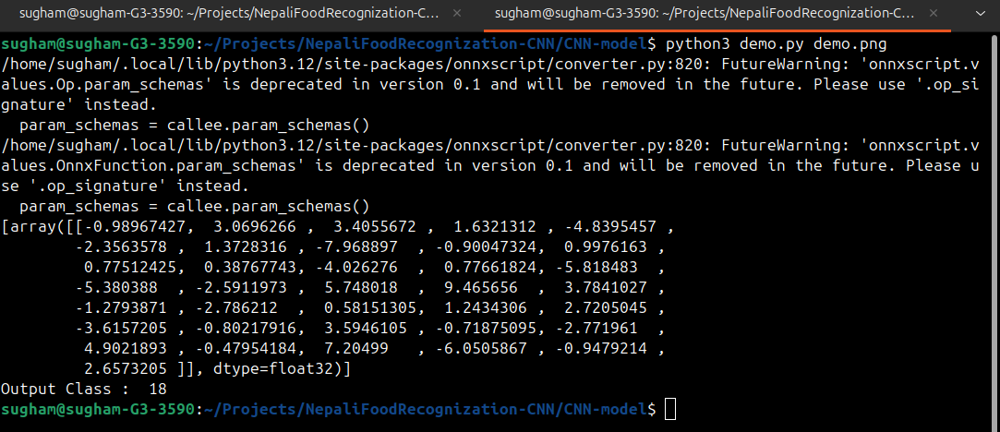

# CNN Model - Nepali Food Detector

### Usage


To train and test the model


```
python3 main.py train
```

```
python3 main.py test
```
<br>

To export to onnx format
```
python3 main.py export
```


### Example



All output classes name and index are at datasets/classes

### Datasets used
https://www.kaggle.com/datasets/dilippokhrel/nepali-food-images
https://www.kaggle.com/datasets/saurabkunwar/nepali-food-images 

